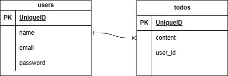

# To Doアプリ
To Doを登録、変更、削除するアプリ

## 環境構築

#### リポジトリをクローン

```
git clone git@github.com:urbexsaku/todo2.git
```

#### Laravelのビルド

```
docker compose up -d --build
```

#### Laravel パッケージのダウンロード

```
docker compose exec php bash
```

```
composer install
```

#### .env ファイルの作成

```
cp .env.example .env
```

#### .env ファイルの修正

```
// 前略

DB_CONNECTION=mysql
- DB_HOST=127.0.0.1
+ DB_HOST=mysql
DB_PORT=3306
- DB_DATABASE=laravel
- DB_USERNAME=root
- DB_PASSWORD=
+ DB_DATABASE=laravel_db
+ DB_USERNAME=laravel_user
+ DB_PASSWORD=laravel_pass

// 後略
```

#### キー生成

```
php artisan key:generate
```

#### マイグレーション・シーディングを実行

```
php artisan migrate
```

## 使用技術（実行環境）

フレームワーク：Laravel 8.75

言語：php 8.1

Webサーバー：nginx 1.21.1

データベース：mysql 8.0.26

## ER図



## URL

アプリケーション：http://localhost/

phpMyAdmin：http://localhost:8080
